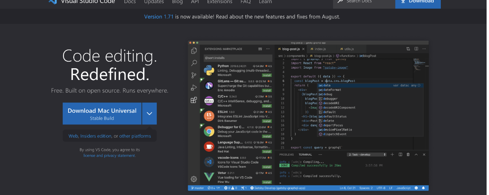
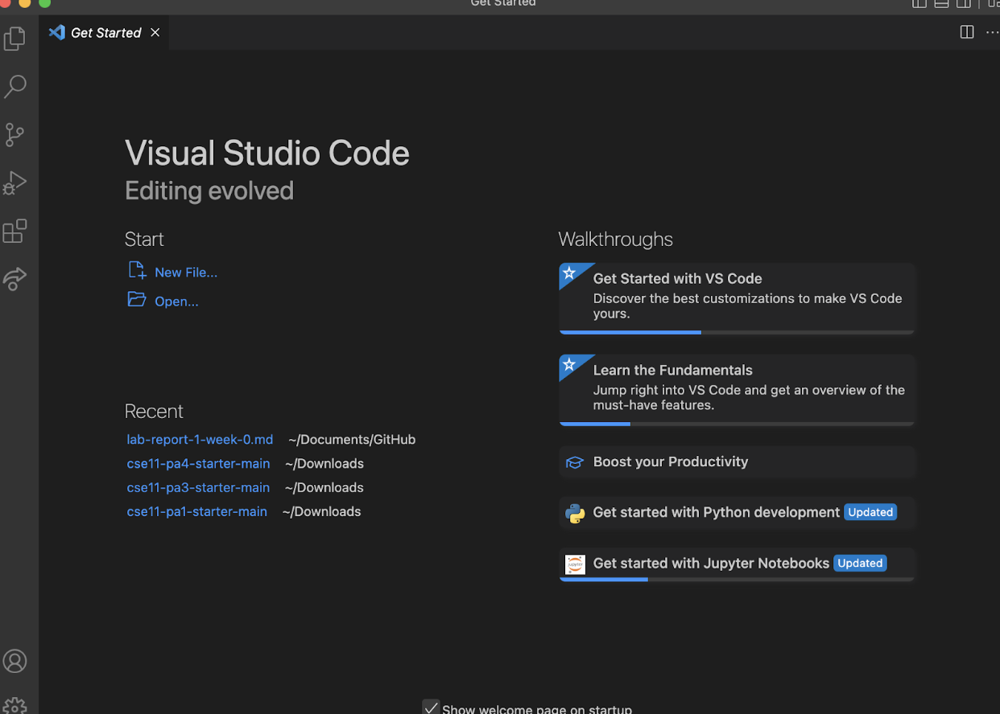
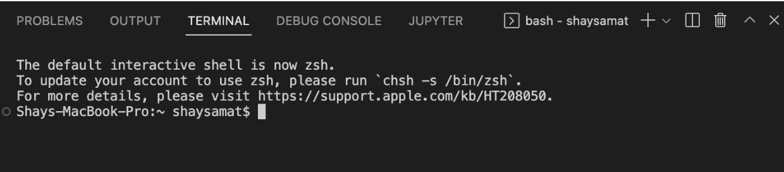
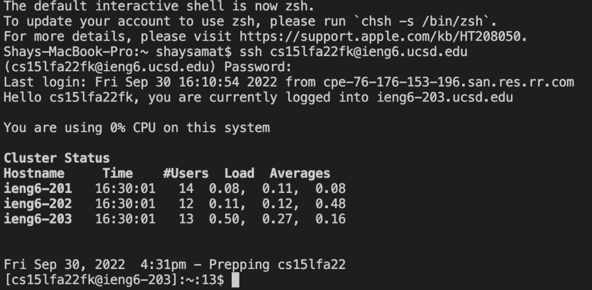
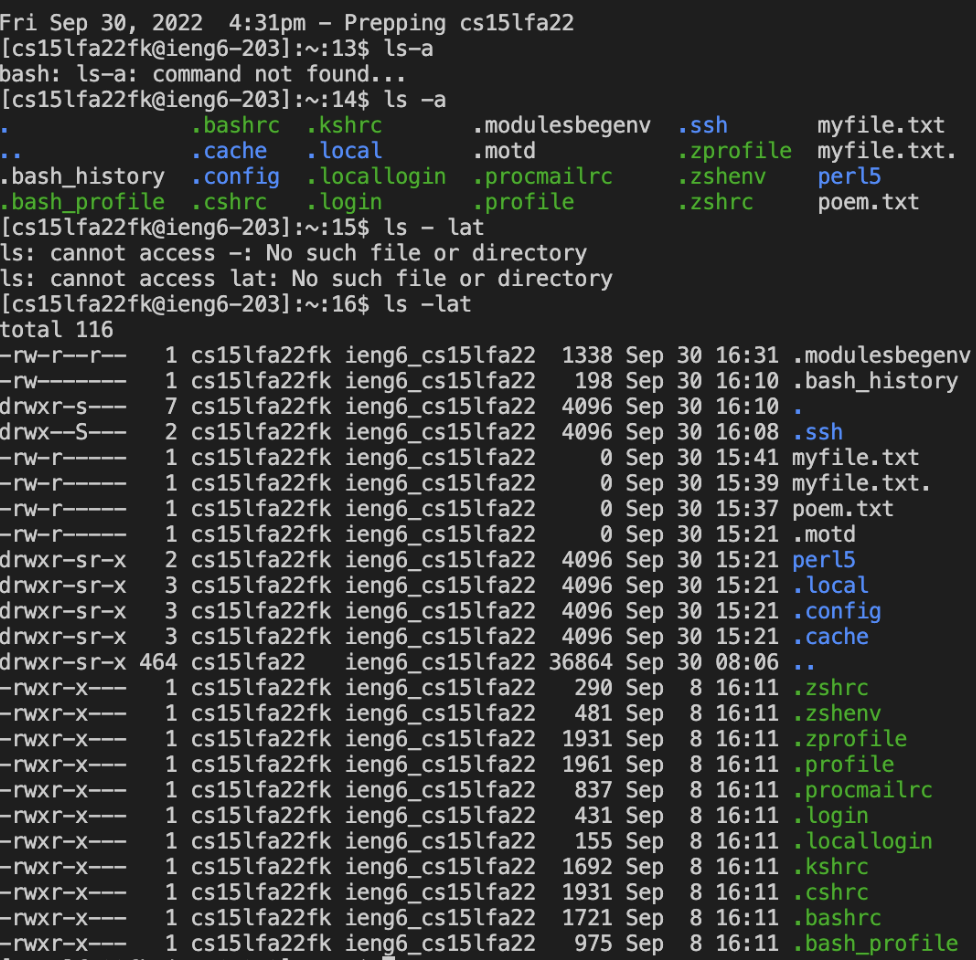

# Lab Report

**Step 1: Download VSC**

* 
* 
* 
1. You want to download VSC from the website https://code.visualstudio.com/
2. The second screenshot would be the screen you should see when you open the application once it's done downloading. 
3. You want to open preferences and create a new terminal and the terminal should look like the third screenshot

**Step 2: Remotely Connecting**
* 
1. You want to put in the command “ssh” in this case, “ssh cs15lfa22fk@ieng6.ucsd.edu”
2. Then enter your password and the output should look like this. 

**Step 3: Try Some Commands**
* 
1. Type in ls -lat in terminal and you should see things resembling the top half of the screenshot which shows the directory.
2. You can type in touch [filename]
3. Then type ls -a in the terminal which also shows more of a directory. 
4. You will see your files in the directory and the timestamp in which you added it.
