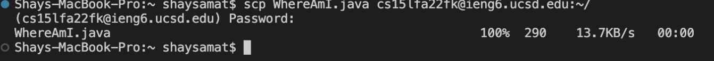
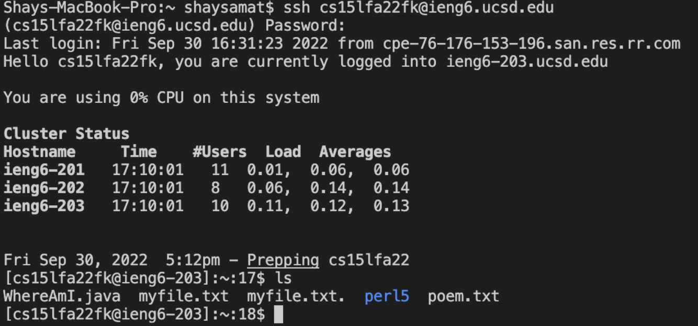
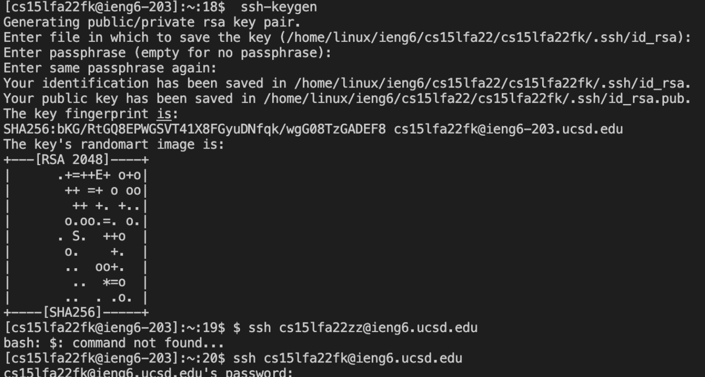
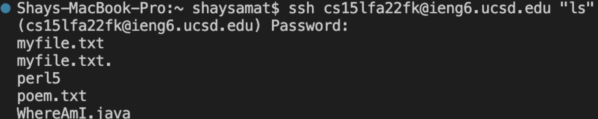

# Lab Report

**Step 1: Download VSC**

* 
* 
* 

1. You want to download VSC from the website https://code.visualstudio.com/
2. The second screenshot would be the screen you should see when you open the application once it's done downloading. 
3. You want to open preferences and create a new terminal and the terminal should look like the third screenshot

**Step 2: Remotely Connecting**
* 

1. You want to put in the command “ssh” in this case, “ssh cs15lfa22fk@ieng6.ucsd.edu”
2. Then enter your password and the output should look like this. 

**Step 3: Try Some Commands**
* 

1. Type in ls -lat in terminal and you should see things resembling the top half of the screenshot which shows the directory.
2. You can type in touch [filename]
3. Then type ls -a in the terminal which also shows more of a directory. 
4. You will see your files in the directory and the timestamp in which you added it.

**Step 4: Moving Files With scp**
* 
* 

1. The first screenshot you want to input in the terminal scp WhereAmI.java cs15lfa22fk@ieng6.ucsd.edu:~/
2. Then after you want to sign back into the ssh ssh cs15lfa22fk@ieng6.ucsd.edu
3. After that you want to do the command ls to see the files, and you will see the WhereAmI.java file there

**Step 5: Setting an SSH Key**
* 

1. First you want to enter ssh-keygen
2. Then you can enter a passphrase for your key, you can enter nothing if you want to
3. After you do this, you can sign back in again with your key and you can switch from ssh to scp

**Step 6: Optimizing Remote Running**
* 

1. You can make things much easier by simply putting the command in quotes
2. You can also use semicolons to run multiple commands in one line

