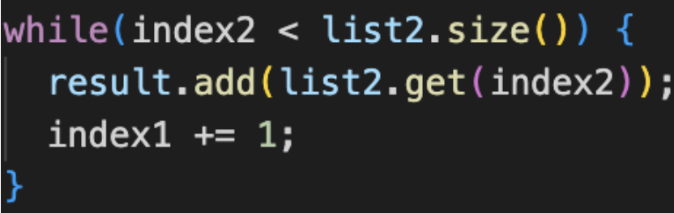

# Lab Report

# Part 1

**Code**

**Screenshot 1**
This is the landing page. The method is below. Once you enter the page, I used String.format to get the message to show on the screen. 

**Screenshot 2**
This is what is printed on the screen when you use the add query. The method is below. After splitting the string after the equals sign, I get the second element in the array and add it to a list and have it show up on the screen. 

**Screenshot 3**
The method below is the search method where I used a for loop to look through all of the words in the list and used the .get(i) for lists to get the element, and then I used .contains of the substring desired and added it to another array list where it later gets printed using String.format. 

# Part 2
**Bug from Array List Examples**
Failure Inducing Output: [4] and [1,2,3] for reversed:

Symptom:

Bug:

Fix: 

The original array was assigned by an empty array and the original array was returned. That is why the symptom was always returning 0, instead of the expected amount.

**Bug from List Examples**
Failure Inducing Output: [4] and [1,2,3] for reversed:

Symptom:

Bug:

Fix: 

The original array was assigned by an empty array and the original array was returned. That is why the symptom was always returning 0, instead of the expected amount.
