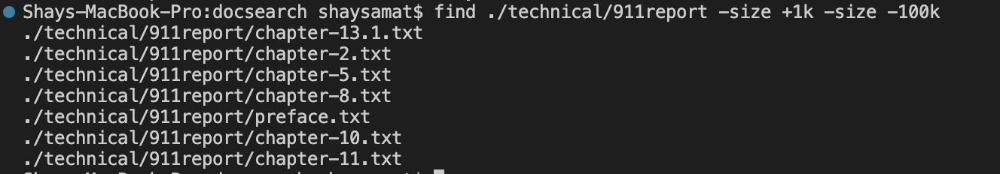

# Lab Report 3

# Find Commands

**Size Code**
Using -size allows you to find files that the files that fit the range of sizes in which you set them to in the terminal. This will help you narrow the file size you are looking for.

**Name Code**
Using -name allows you to find the name of all the files in which you want to get.

**IName Code**
Using -iname allows you to find the name of all the files in which you want to get, however it is not case-specific. This means it will return all files lowercase and uppercase. As you can see in the first example, both trials with s and S returned the same results

