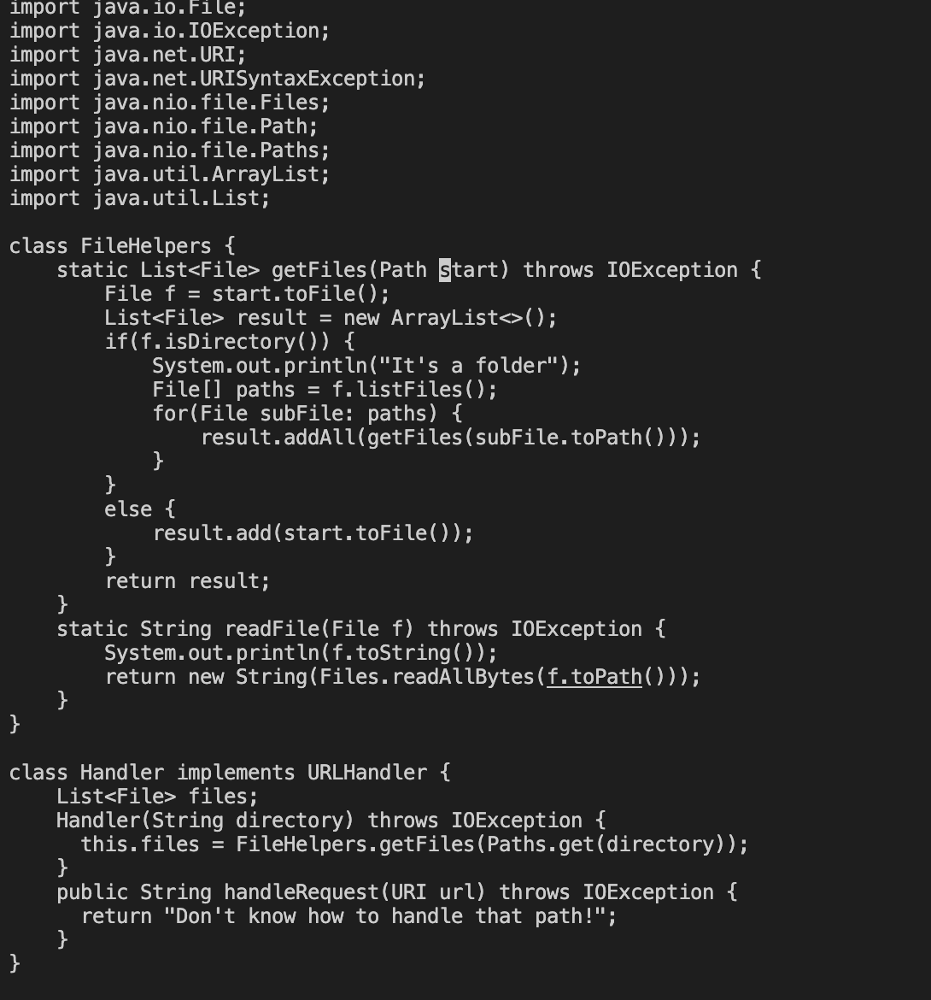
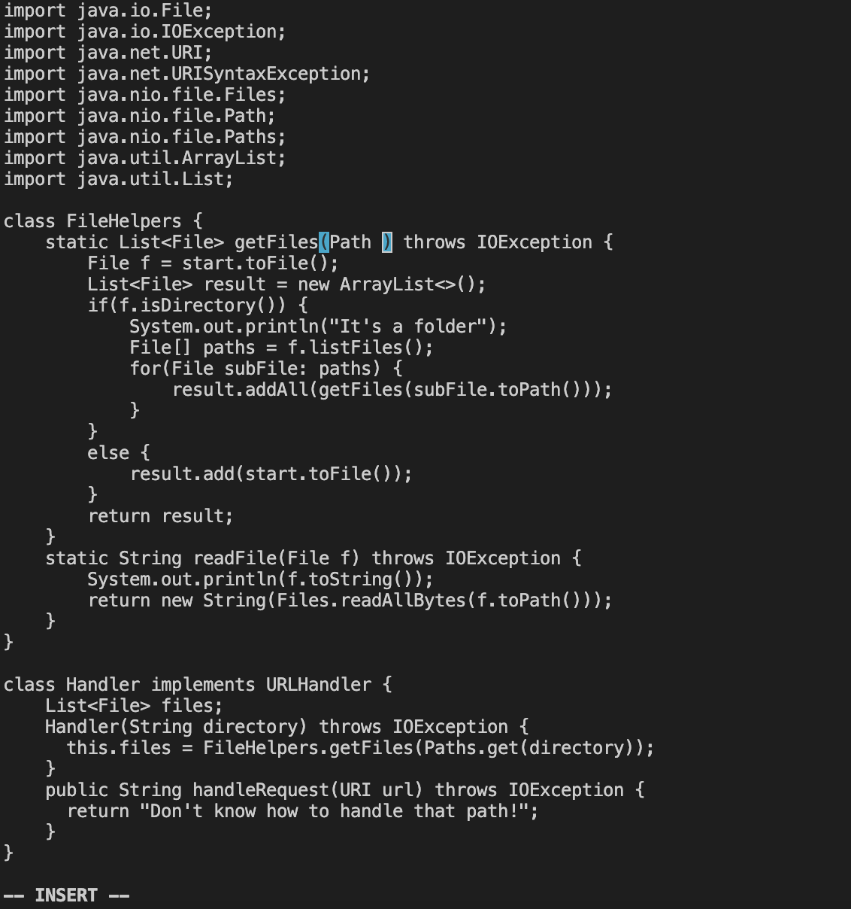
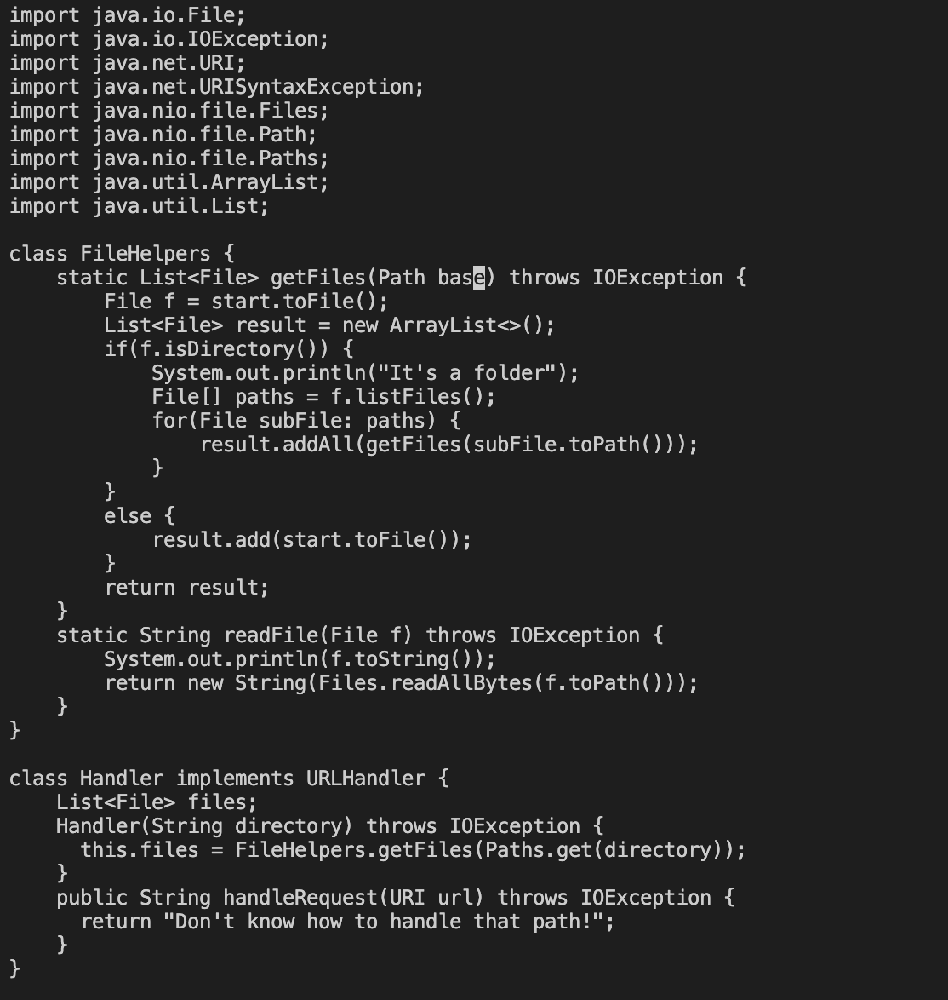
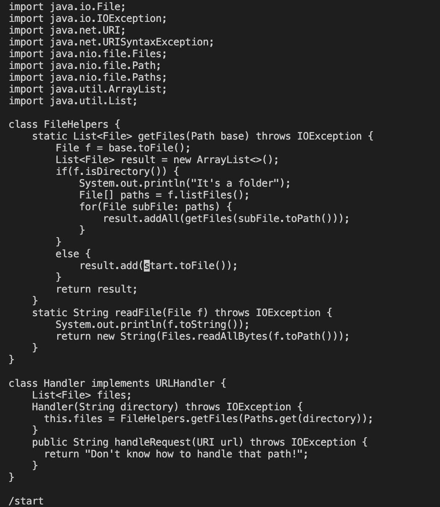
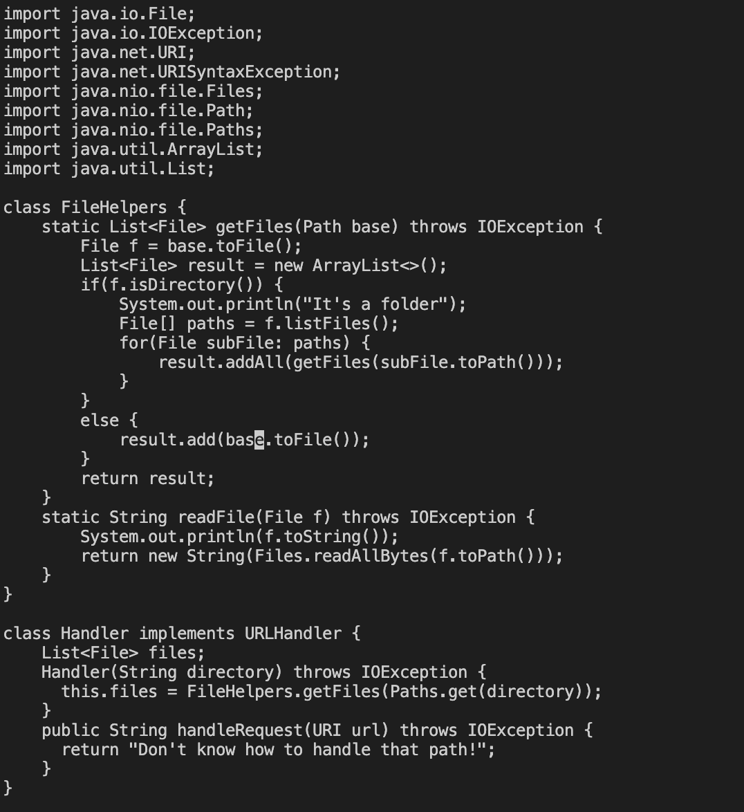
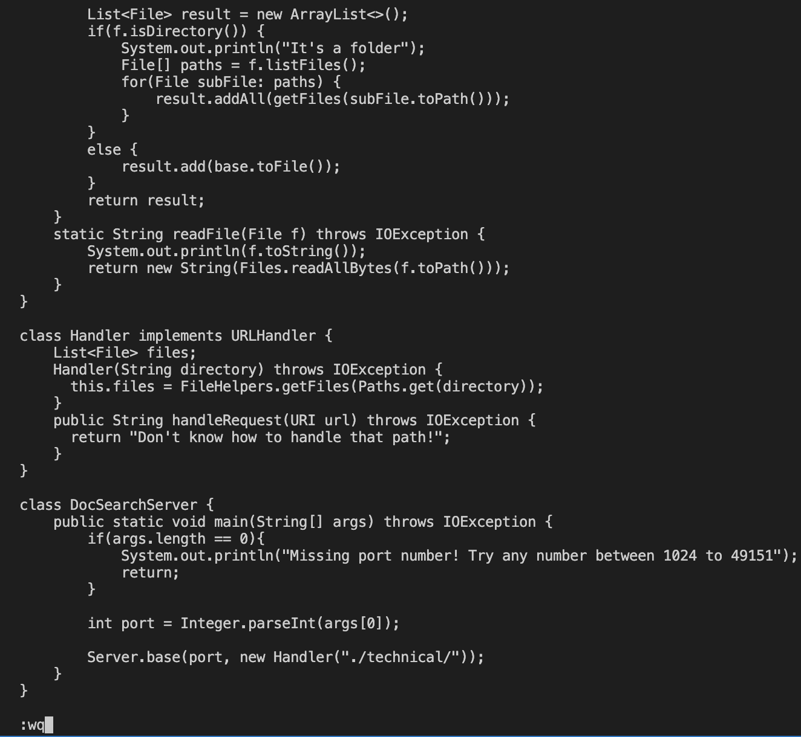

# Lab Report 4

# Part 1
*Using the greater/less than symbols caused errors for my images. I decided to use hyphens to signifiy the keyboard movements instead.*

```
/start -enter - cebase -esc- n.n.n.:wq -enter-
```
```
/start -Enter-
```
This searches for the word "start" in the file

```
ce
```
Switching into input mode and deleting the word "start"

```
base-esc-
```
This replaces the text and returning to insert mode

```
n.n.n.
```
Using n. allows you to repeat the actions you just completed. So this allows me to repeat the same algorithm consisting of searching for start and replacing it with base 3 times.


```
:wq-enter-
```
This saves the file. 


# Part 2
Method 1 using VSC/SCP:
This took me a minute and seventeen seconds. I did not encounter any difficulties during this method.

Method 2 using VIM:
This took me a thirty-five seconds. I did not encounter any difficulties during this method.

Which of these two styles would you prefer using if you had to work on a program that you were running remotely, and why?

I believe that I would prefer to use Vim if i had to work on a program I was running remotely. This is because it is clearly much more efficient than the first method using VSC and SCP.

What about the project or task might factor into your decision one way or another? (If nothing would affect your decision, say so and why!)

I feel like if it was a bigger project, I would use VSC because I feel more comfortable in that environment and Vim for smaller files and tasks. I also need to get more familiar with the vim commands and this may lead me to keep choosing Vim over VSC.

