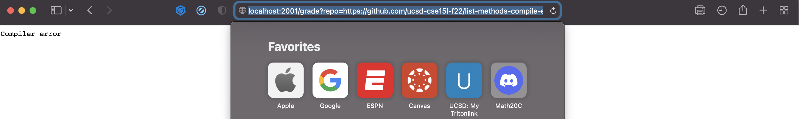

# Lab Report 5

# Part 1

```
rm -rf student-submission 
git clone $1 student-submission
cp TestListExamples.java student-submission/ 
cp -r lib student-submission/ 
if [ ! -e student-submission/ListExamples.java ] 
    then 
        echo "Student submission does not contain proper files" 
        exit 1
fi

pushd student-submission

javac -cp .:lib/hamcrest-core-1.3.jar:lib/Junit-4.13.2.jar *.java
if [ ! $? -eq 0 ]
    then   
        echo "Compiler error"
        exit 1
fi
java -cp .:lib/hamcrest-core-1.3.jar:lib/Junit-4.13.2.jar org.junit.runner.JUnitCore TestListExamples > TestResults.txt

if grep "OK" TestResults.txt 
    then
        echo "All Tests Passed"
fi
if grep "FAILURES" TestResults.txt 
    then
        echo "Failed"
fi

popd 
```
https://github.com/ucsd-cse15l-f22/list-methods-corrected


https://github.com/ucsd-cse15l-f22/list-methods-compile-error


https://github.com/ucsd-cse15l-f22/list-methods-lab3,


# Part 2 - Trace

Tracing https://github.com/ucsd-cse15l-f22 list-methods-corrected

```
git clone $1 student-submission
```

Standard Output:
```
Cloning into 'student-submission'...
remote: Enumerating objects: 4, done.
remote: Counting objects: 100% (4/4), done.
remote: Compressing objects: 100% (2/2), done.
remote: Total 4 (delta 0), reused 4 (delta 0), pack-reused 0
Unpacking objects: 100% (4/4), done.
```
Standard Error: None - Return Code: 0

```
if [ ! -e student-submission/ListExamples.java ] 
    then 
        echo "Student submission does not contain proper files" 
        exit 1
fi
```

Standard Output: Student submission does not contain proper files 
Standard Error: None - Return Code: 0
Since this submission had the proper files, it will echo "Student submission does not contain proper files"

```
javac -cp .:lib/hamcrest-core-1.3.jar:lib/junit-4.13.2.jar *.java
```
Standard Output: None - Standard Error: None - Return Code 0

```
if [ ! $? -eq 0 ]
    then   
        echo "Compiler error"
        exit 1
fi
```
Standard Output: None - Standard Error: None - Return Code: 0

There is no output here because there is no compile error. 

```
java -cp .:lib/hamcrest-core-1.3.jar:lib/Junit-4.13.2.jar org.junit.runner.JUnitCore TestListExamples > TestResults.txt

```
Standard Output: 
```
JUnit version 4.13.2
..
Time: 0.007

OK (2 tests)

```
Standard Error: None - Return Code: 0

```
if grep "OK" TestResults.txt &>/dev/null
    then
        echo "All Tests Passed"
fi
```
Standard Output: All Tests Passed
Standard Error: None - Return Code: 0

if grep "FAILURES" TestResults.txt &>/dev/null
    then
        echo "Failed"
fi
Standard Output: None - Standard Error: None - Return Code: 0

